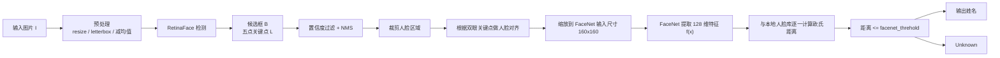

# Facenet + RetinaFace 人脸识别项目

这个项目把 RetinaFace 人脸检测和 FaceNet 人脸特征编码串在一起，用于完成图片、视频或文件夹中的人脸识别。整体流程是：先找出图像中的人脸位置和五点关键点，再把人脸对齐并转换为 128 维特征向量，最后和本地人脸库中的向量做距离比对。

## 目录

1. [环境依赖](#环境依赖)
2. [项目结构](#项目结构)
3. [权重与配置](#权重与配置)
4. [建立人脸库](#建立人脸库)
5. [运行预测](#运行预测)
6. [模型识别原理](#模型识别原理)
7. [常见问题](#常见问题)

## 环境依赖

建议使用独立的 Python 环境安装依赖：

```bash
pip install -r requirements.txt
```

当前 `requirements.txt` 中的主要版本如下：

```text
torch==1.2.0
torchvision==0.4.0
opencv_python==4.1.2.30
numpy==1.17.0
Pillow==8.2.0
scipy==1.2.1
matplotlib==3.1.2
tqdm==4.60.0
h5py==2.10.0
```

如果电脑没有可用 GPU，请在 `retinaface.py` 的默认配置里把 `cuda` 改为 `False`。

## 项目结构

```text
.
├── encoding.py                 # 读取 face_dataset，生成人脸特征库
├── predict.py                  # 单图、视频、FPS、文件夹预测入口
├── retinaface.py               # RetinaFace 检测 + FaceNet 识别主流程
├── requirements.txt            # Python 依赖版本
├── face_dataset/               # 已知人员图片，命名格式如 张三_1.jpg
├── img/                        # 测试图片
├── model_data/                 # 模型权重、字体、人脸特征库
├── nets/                       # FaceNet 相关网络
├── nets_retinaface/            # RetinaFace 相关网络
└── utils/                      # 图像预处理、框解码、距离计算等工具
```

## 权重与配置

默认配置在 `retinaface.py` 的 `Retinaface._defaults` 中。权重、主干网络和阈值必须互相匹配，否则可能无法加载模型或识别效果异常。

```python
_defaults = {
    "retinaface_model_path": "model_data/Retinaface_mobilenet0.25.pth",
    "retinaface_backbone": "mobilenet",
    "confidence": 0.5,
    "nms_iou": 0.3,
    "retinaface_input_shape": [640, 640, 3],
    "letterbox_image": True,

    "facenet_model_path": "model_data/facenet_mobilenet.pth",
    "facenet_backbone": "mobilenet",
    "facenet_input_shape": [160, 160, 3],
    "facenet_threhold": 0.9,

    "cuda": True,
}
```

关键配置说明：

- `retinaface_model_path`：RetinaFace 检测模型权重路径。
- `retinaface_backbone`：检测模型主干，可选 `mobilenet` 或 `resnet50`。
- `confidence`：检测框置信度阈值，低于该分数的框会被过滤。
- `nms_iou`：非极大值抑制阈值，用于去掉高度重叠的重复框。
- `facenet_model_path`：FaceNet 特征提取模型权重路径。
- `facenet_backbone`：识别模型主干，可选 `mobilenet` 或 `inception_resnetv1`。
- `facenet_threhold`：人脸特征距离阈值，距离小于等于该值时认为匹配。
- `cuda`：是否使用 GPU；笔记本没有 CUDA 环境时改为 `False`。

## 建立人脸库

把已知人员图片放到 `face_dataset/`，命名规则为：

```text
姓名_编号.jpg
```

示例：

```text
张三_1.jpg
张三_2.jpg
李四_1.jpg
```

然后运行：

```bash
python encoding.py
```

程序会检测每张图片中的最大人脸，提取特征向量，并在 `model_data/` 中生成：

```text
{facenet_backbone}_face_encoding.npy
{facenet_backbone}_names.npy
```

更换 `facenet_model_path` 或 `facenet_backbone` 后，需要重新运行 `encoding.py`，否则旧特征库和新模型可能不匹配。

## 运行预测

运行：

```bash
python predict.py
```

默认 `mode = "predict"`，程序会提示输入图片路径，例如：

```text
img/zhangxueyou.jpg
```

`predict.py` 支持以下模式：

- `predict`：单张图片预测。
- `video`：摄像头或视频文件预测。
- `fps`：测试单张图片的推理速度。
- `dir_predict`：遍历文件夹中的图片并保存检测结果。

切换模式时，修改 `predict.py` 中的 `mode` 变量即可。视频路径、保存路径、测试次数和文件夹路径也都在同一个文件中配置。

## 模型识别原理

### 总流程



### 1. RetinaFace 找到人脸的位置

对输入图片 `I`，RetinaFace 会预测一组候选人脸框和关键点。单个人脸检测结果可以写成：

```text
B = (x1, y1, x2, y2, score)
```

其中：

- `(x1, y1)` 是人脸框左上角坐标。
- `(x2, y2)` 是人脸框右下角坐标。
- `score` 是该区域属于人脸的置信度。

RetinaFace 同时预测 5 个人脸关键点：

```text
L = {
  (x_left_eye, y_left_eye),
  (x_right_eye, y_right_eye),
  (x_nose, y_nose),
  (x_left_mouth, y_left_mouth),
  (x_right_mouth, y_right_mouth)
}
```

可以把它理解成“先画框，再标点”：框告诉程序人脸在哪里，关键点告诉程序眼睛、鼻子、嘴角的大致位置。

```text
(x1,y1) ┌──────────────────┐
        │  ●          ●    │  左右眼
        │        ●         │  鼻尖
        │    ●       ●     │  左右嘴角
        └──────────────────┘ (x2,y2)
```

### 2. 过滤重复框并对齐人脸

模型会产生多个候选框，程序先用 `confidence` 去掉低分框，再用 NMS 去掉重叠太高的重复框。

对齐阶段会利用两只眼睛的连线角度做仿射变换，让倾斜的人脸尽量转正。代码中对应的是 `Alignment_1`：

```text
angle = atan((y_left_eye - y_right_eye) / (x_left_eye - x_right_eye))
```

对齐后的好处是，同一个人因为歪头、拍摄角度不同造成的差异会变小，FaceNet 提取出来的向量更稳定。

### 3. FaceNet 把人脸变成数字向量

裁剪并对齐后的人脸会被缩放到 `facenet_input_shape`，默认是：

```text
160 x 160 x 3
```

随后 FaceNet 会把这张人脸图转换成一个 128 维特征向量：

```text
f(x) = [v1, v2, v3, ..., v128] ∈ R^128
```

这个向量可以理解成“人脸数字指纹”：同一个人的向量距离应该更近，不同人的向量距离应该更远。

### 4. 用欧氏距离判断是谁

`encoding.py` 会提前把 `face_dataset/` 中的已知人脸编码成向量库。预测时，新人脸向量 `a` 会和库里的每个向量 `b` 做欧氏距离：

```text
d(a, b) = sqrt(sum((a_i - b_i)^2))
```

判断规则：

```text
if d(a, b) <= facenet_threhold:
    认为是同一个人
else:
    认为不是同一个人
```

程序会选择距离最近且小于等于阈值的人名；如果所有距离都超过 `facenet_threhold`，就显示 `Unknown`。

## 常见问题

### 1. 为什么换了 FaceNet 权重后识别变差？

FaceNet 权重变化后，特征向量空间也会变化。需要重新运行：

```bash
python encoding.py
```

让 `model_data/` 中的人脸库向量和当前识别模型保持一致。

### 2. 为什么检测不到人脸？

优先检查：

- 图片路径是否正确。
- `retinaface_model_path` 是否存在。
- `retinaface_backbone` 是否和权重匹配。
- `confidence` 是否设置过高。
- 没有 GPU 时 `cuda` 是否已经改成 `False`。

### 3. 为什么同一个人被识别成 Unknown？

可以从三处排查：

- 人脸库图片是否清晰、正脸、无遮挡。
- `facenet_threhold` 是否过低。
- 当前预测使用的 `facenet_backbone` 是否和 `encoding.py` 生成特征库时一致。

### 4. 为什么有多个人脸时只编码了一个？

`encoding.py` 在建立人脸库时会选择图片中面积最大的人脸作为该图片的身份特征。做人脸库时建议一张图片只放一个清晰人脸，减少误编码。
